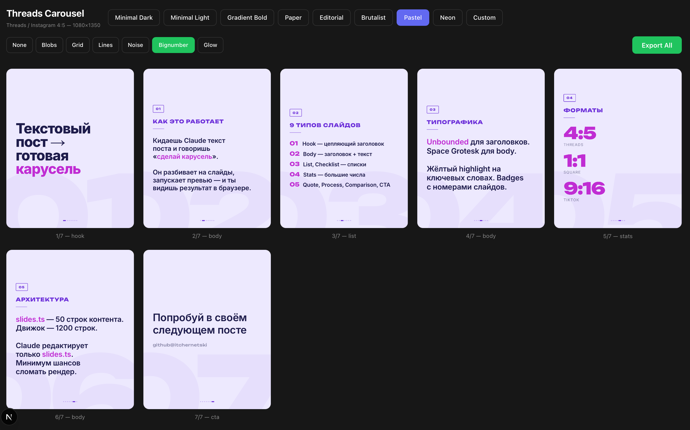

# threads-carousel-claude-skill

A [Claude Code](https://claude.com/claude-code) skill that converts text posts into visual carousel images for **Threads, Instagram, LinkedIn, TikTok, and Stories**.



Paste a text post (or a Markdown file) into Claude, say "сделай карусель" / "make a carousel", and get a browser preview with exportable PNGs. Opinionated dark-mode design system with a bold display typeface (Unbounded), 9 composable slide types, 7 background styles, and multi-platform format presets.

## Features

- **9 slide types** — hook, body, list, stats, quote, checklist, process, comparison, cta
- **5 format presets** — Threads 4:5, Instagram square, LinkedIn document PDF, TikTok 9:16, Stories 9:16
- **9 style presets** — Minimal Dark, Minimal Light, Gradient Bold, Paper, Editorial, Brutalist, Pastel, Neon, Custom
- **7 background decorations** — none, organic blobs, dot grid, diagonal lines, SVG noise, big number watermark, radial glow
- **Highlighted keywords** — any word in title or body can be colored in the accent color
- **Badges** — small outlined tags above titles (`01`, `02`, `TIP`, `NEW`)
- **Text balance** — `text-wrap: balance` on hooks and titles to prevent orphan words
- **Adaptive typography** — font size scales to content length
- **Modular architecture** — content in `src/slides.ts`, engine in `src/app/page.tsx` + `src/lib/`
- **Live preview toolbar** — switch style presets and background types in the browser without editing code
- **PNG export** — download individual slides or all at once via `html-to-image`

## Quick start

### As a Claude Code skill

1. Clone the repo into your Claude skills directory:
   ```bash
   mkdir -p ~/.claude/skills
   git clone https://github.com/itchernetski/threads-carousel-claude-skill.git ~/.claude/skills/threads-carousel
   ```

2. Install template dependencies (one-time):
   ```bash
   cd ~/.claude/skills/threads-carousel/template
   bun install   # or pnpm / npm
   ```

3. In Claude Code, trigger the skill by pasting a post and saying:
   > Сделай карусель из этого поста
   >
   > or: Make a Threads carousel from this text

Claude reads the text, splits it into slides, edits `src/slides.ts` in a temporary working copy of the template, launches `bun dev` on port 3333, and hands you the preview URL.

### Standalone (without Claude)

You can also use the template directly as a Next.js carousel generator:

```bash
cd template
bun install
# Edit src/slides.ts with your content
bun dev --port 3333
# Open http://localhost:3333
# Click "Export All" to download PNGs
```

## Architecture

```
template/
├── src/
│   ├── slides.ts              ← ✏️  Edit this: your SLIDES array + defaults
│   ├── lib/
│   │   ├── types.ts           ← Shared type definitions
│   │   └── presets.ts         ← PRESETS (styles) + FORMAT_PRESETS (platforms)
│   └── app/
│       ├── page.tsx           ← Rendering engine (do not edit for content)
│       ├── layout.tsx         ← Next.js root layout + font loading
│       └── globals.css        ← Minimal global styles
├── package.json               ← Dependencies (Next.js, React, html-to-image)
├── tsconfig.json
├── next.config.ts
└── postcss.config.mjs
```

**The golden rule:** to change carousel content, only touch `src/slides.ts`. Everything else is the engine.

## Slide types reference

Each slide is an object in the `SLIDES` array with a `type` field and type-specific fields:

```ts
// hook — opening slide
{ type: "hook", text: "Claude Code\nis smarter with skills", highlight: "skills" }

// body — title + paragraph
{ type: "body", badge: "01", title: "Title", text: "Body text", highlight: "key" }

// list — numbered items
{ type: "list", title: "Steps", items: ["First", "Second", "Third"] }

// stats — big numbers
{ type: "stats", title: "Impact", stats: [
  { value: "3×", label: "More saves" },
  { value: "40%", label: "Faster" },
]}

// quote — pulled quote
{ type: "quote", text: "Quote text", author: "Someone", role: "2026" }

// checklist — checkmarks
{ type: "checklist", title: "Pre-flight", items: ["One", "Two", "Three"] }

// process — numbered steps with connector
{ type: "process", title: "How it works", steps: [
  { title: "Step 1", text: "Description" },
  { title: "Step 2", text: "Description" },
]}

// comparison — two-column VS
{ type: "comparison", title: "Before vs after",
  leftLabel: "Before", leftItems: ["Slow", "Manual"],
  rightLabel: "After", rightItems: ["Fast", "Automated"],
}

// cta — final call to action
{ type: "cta", text: "Follow for more", handle: "@username" }
```

## Defaults

- **Style:** `minimal-dark` (black background, white text, yellow highlight)
- **Background:** `glow` (soft radial gradient in alternating corners)
- **Format:** `threads-4x5` (1080×1350)
- **Fonts:** Unbounded (display) + Space Grotesk (body)
- **Padding:** 80px, left-aligned

Change any of these in `src/slides.ts` via the `ACTIVE_PRESET`, `DEFAULT_BG`, and `DEFAULT_FORMAT` constants.

## Design system

| Element | Size | Weight | Font |
|---|---|---|---|
| Hook | 104–140px | 800 | Unbounded |
| Title | 44px | 800 uppercase | Unbounded |
| Body | 48–88px | 600 | Space Grotesk |
| Badge | 26px | 800 uppercase | Unbounded |
| Stats value | 140–170px | 900 | Unbounded |
| Quote | 62px | 600 | Unbounded |
| List item | 46px | 600 | Space Grotesk |
| Handle | 36px | 500 | Unbounded |

## Tech stack

- **Next.js 15** — React framework + `next/font/google` for font loading
- **React 19** — rendering
- **TypeScript 5** — type safety
- **Tailwind CSS 4** — minimal usage (mostly for reset)
- **html-to-image** — client-side PNG export
- **Unbounded** + **Space Grotesk** + **Inter** + **Playfair Display** — via Google Fonts

## Customization

### Adding a new style preset

Add an entry to the `PRESETS` object in `src/lib/presets.ts`:

```ts
"my-style": {
  id: "my-style",
  name: "My Style",
  bg: "#0A0A0A",              // background color
  bgGradient: undefined,      // optional CSS gradient (overrides bg)
  textColor: "#FFFFFF",        // primary text
  textSecondary: "rgba(…)",    // muted text (badges, labels)
  accentColor: "#6366F1",      // dividers, decorative elements
  highlightColor: "#FACC15",   // keyword highlight color
  fontFamily: "var(--font-inter)",          // body font
  hookFontFamily: "var(--font-unbounded)",  // optional, hook font
},
```

Available font CSS variables (already loaded via Google Fonts):
- `--font-unbounded` — geometric display, great for hooks
- `--font-space-grotesk` — modern grotesque, good for body
- `--font-inter` — neutral sans-serif
- `--font-playfair` — classic serif

Then set `ACTIVE_PRESET` in `src/slides.ts` to your new preset id.

To add a custom font: import it in `src/app/layout.tsx` via `next/font/google`, add a CSS variable, and reference it in your preset.

### Modifying format presets

Add a new entry to `FORMAT_PRESETS` in `src/lib/presets.ts` and update the `FormatId` union type in `src/lib/types.ts`.

## Roadmap

- [ ] **Satori + Resvg server-side export** — replace browser-based `html-to-image` with headless PNG generation (and PDF for LinkedIn documents). See [Slashgear/linkedin-carousel-gen](https://github.com/Slashgear/linkedin-carousel-gen) for reference.
- [ ] **Runtime format switcher** — currently format is edited in `src/slides.ts`; could be a React state with canvas dimensions via context.
- [ ] **Per-slide background override** — different bg type per slide.
- [ ] **Cyrillic-optimized defaults** — adjust adaptive sizing thresholds for Russian/Cyrillic text density.

## Related projects

- [Slashgear/linkedin-carousel-gen](https://github.com/Slashgear/linkedin-carousel-gen) — LinkedIn carousels via Satori + PDF (TypeScript + Bun)
- [FranciscoMoretti/carousel-generator](https://github.com/FranciscoMoretti/carousel-generator) — in-browser LinkedIn carousel editor
- [PritishMishraa/thread-to-carousel](https://github.com/PritishMishraa/thread-to-carousel) — Twitter thread → LinkedIn carousel
- [fern-opensource/carouselmaker](https://github.com/fern-opensource/carouselmaker) — LinkedIn carousels via LangGraph + Claude + Figma MCP

## License

MIT — see [LICENSE](LICENSE).

---

Built with [Claude Code](https://claude.com/claude-code).
